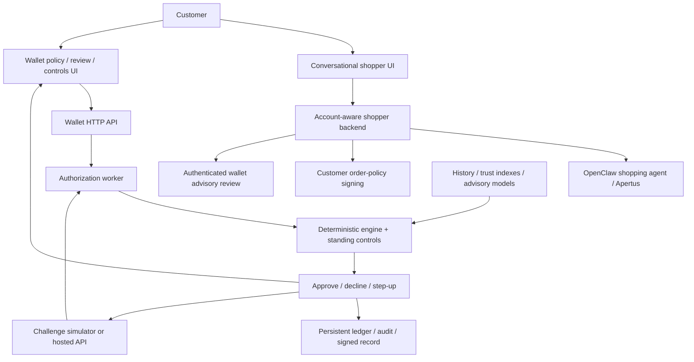

# LEASH

### Give an AI agent a shopping task. Keep control of the money.

**Swiss AI Weeks · Viseca · Agent on a Leash**

LEASH is a working prototype for customer-controlled AI spending. A customer describes what an agent may buy, reviews the resulting permissions, and retains the ability to tighten or revoke them. An independent wallet evaluates proposed purchases and returns **approve**, **decline**, or **ask the customer** (`step_up`), with the evidence and uncertainty behind its decision.

The project combines a conversational shopping experience, a deterministic authorization backend, a customer control interface, and a reproducible merchant-data and model pipeline in one repository.

**[Live shopper](https://viseca-shopper.pixerful.com/) · [Wallet controls](https://viseca-shopper.pixerful.com/wallet/) · [Five-minute demo](DEMO.md) · [Official challenge](https://zh.ai-weeks.ch/challenges/agent-on-a-leash)**

> **Start here:** The wallet is the core challenge deliverable. The shopper demonstrates the surrounding customer journey. Reviewers can run the wallet and its tests locally without an AI-provider key or OpenClaw installation. The deployed wallet currently uses offline scenarios; live shopper availability does not imply that an issuer payment was executed.

**Contents:** [Overview](#at-a-glance) · [Challenge evidence](#challenge-alignment-and-reviewer-evidence) · [Architecture](#architecture-and-authority-boundaries) · [Customer controls](#customer-experience-and-implemented-controls) · [Merchant intelligence](#merchant-intelligence-and-purchase-evidence) · [AI work](#ai-and-statistical-work) · [Safeguards](#lifecycle-integrity-and-operational-safeguards) · [Data](#data-engineering-and-reproducibility) · [Run locally](#run-and-evaluate) · [Verification](#verification-evidence)

## At a glance

| What we built | Why it matters | Where to inspect |
| --- | --- | --- |
| Customer-managed permissions | Delegation has explicit limits, visible uncertainty, and a revocation path | [Compiler](wallet-control/lib/policy-compiler.js), [customer interface](wallet-control/web/app.js) |
| Independent authorization engine | Merchant text and agent output cannot directly grant spending authority | [Engine](wallet-control/lib/engine.js), [worker](wallet-control/lib/worker.js) |
| Persistent approval lifecycle | Retries, overlapping approvals, late answers, and spending state are treated as correctness problems | [Store](wallet-control/lib/store.js), [lifecycle tests](wallet-control/test/wallet-upgrade.test.js) |
| Swiss-model shopping assistant | Natural-language discovery and purchase proposals use a configurable agent backend; the deployed model is Apertus v1.5 70B | [Shopper backend](viseca-shopper-ui/server.js) |
| Merchant and transaction evidence | Domain reputation, business identity, product terms, customer history, and manipulation signals are assessed separately | [Signals](wallet-control/lib/signals.js), [merchant dossiers](wallet-control/lib/yellowlist.js) |
| Trained advisory models | Model experiments, calibration, failure cases, and cross-language parity are inspectable | [Injection model card](merchant-trust-data/models/prompt_injection/EVAL.md), [behavior model card](merchant-trust-data/models/behavior/EVAL.md) |
| Verifiable decisions | Signed documents bind a decision to its recorded policy and purchase facts | [Proof implementation](wallet-control/lib/wallet-proof.js) |
| Reproducible data collection | Collected snapshots, curated exports, provenance, and model artifacts accompany the code | [Source catalogue](merchant-trust-data/DATA_SOURCES.md), [snapshot manifest](merchant-trust-data/data/snapshots/manifest.json) |

**Verification snapshot, 25 September 2026:** 275 wallet checks, 72 shopper tests, and 33 data-pipeline tests passed. Both JavaScript applications also passed their test suites from a clean checkout of the published files. These results describe this submission, not production certification or universal attack resistance.

## The problem we address

A useful shopping agent must explore offers and propose action. A customer still needs reliable answers to four questions:

1. Is this within the amount and frequency I authorized?
2. Is this the product, quantity, merchant, and set of terms I intended?
3. Has untrusted content attempted to influence the agent or wallet?
4. Can I understand, stop, or correct the action before permission is granted?

LEASH makes these questions explicit in the product. The customer can inspect executable permissions, see why a purchase was paused, answer a review request, and examine the resulting record. Unresolved instruction meaning remains visible instead of disappearing during translation.

## Challenge alignment and reviewer evidence

The [challenge brief](https://zh.ai-weeks.ch/challenges/agent-on-a-leash) asks for independent wallet controls, understandable permissions and decisions, stateful purchase handling, useful intervention, and predictable behavior when optional services fail. This table connects those requirements to implementation evidence.

| Challenge requirement | LEASH implementation | Evidence |
| --- | --- | --- |
| Translate input into executable permissions | Deterministic parsing, plain-language interpretation, unresolved questions, explicit confirmation, guided clarification | [Compiler](wallet-control/lib/policy-compiler.js), [coverage tests](wallet-control/test/policy-coverage.test.js) |
| Let the customer tighten or revoke | Additive rule tightening, stricter uncertainty handling, revocation, pending-review closure | [Wallet API](wallet-control/server.js), [store](wallet-control/lib/store.js) |
| Explain approve, decline, or step-up | Rule results, reason codes, evidence, uncertainty, and customer messages | [Engine](wallet-control/lib/engine.js) |
| Handle limits, retries, and prior decisions | Persistent spending, fingerprints, serialized resolution, submission reservations, late-approval rechecks | [Worker](wallet-control/lib/worker.js), [regression tests](wallet-control/test/priority-regression.test.js) |
| Treat merchant text as untrusted | Deterministic manipulation detection, trained text scorer, optional semantic review | [Signals](wallet-control/lib/signals.js), [adversarial battery](wallet-control/test/injection-battery.test.js) |
| Preserve an ordinary-purchase path | Known-history compliant purchases can pass without human interruption | [Customer HTTP-flow test](wallet-control/test/server-flow.test.js) |
| Support human approval, rejection, and revocation | Inbox, explicit answers, expiry, current-policy revalidation | [Customer flow](wallet-control/test/server-flow.test.js), [upgrade tests](wallet-control/test/wallet-upgrade.test.js) |
| Handle optional-service failures predictably | Bounded enrichment, validated model output, deterministic checks retained | [Jev tests](wallet-control/test/jev.test.js), [worker](wallet-control/lib/worker.js) |
| Separate interface and backend | Distinct UI, HTTP API, rule engine, and platform adapter | [Server](wallet-control/server.js), [API client](wallet-control/lib/api.js) |

The engine evaluates purchase facts and rules. It does not select decisions by scenario name, authorization ID, or event sequence position.

## Architecture and authority boundaries



The **shopper** uses account-specific conversations and customer-signed order policies. The **wallet** has its own authorization worker, policy state, decision ledger, and enrolled-device interface. The shopper calls the wallet's authenticated advisory-review endpoint before signing and exposes the wallet UI through `/wallet/`.

These components cooperate while maintaining distinct state. The prototype does **not** claim that every external merchant checkout is automatically routed through an issuer-level wallet authorization hook. Wallet standing controls cover purchases processed by its worker; shopper account and family restrictions are separately enforced at order-policy signing.

### Purchase lifecycle

1. **Describe:** the customer states the intended purchase and restrictions.
2. **Translate:** supported constraints become rules; unsupported meaning produces questions and a review requirement.
3. **Confirm:** the customer reviews permissions before activation. The wallet verifies the signed draft rather than trusting edited client rules.
4. **Evaluate:** the worker checks policy, standing controls, available evidence, and existing spending.
5. **Intervene:** a hard violation declines; relevant uncertainty or manipulation can request human review.
6. **Recheck the answer:** approval rechecks expiry, current permission, and spending windows affected by that purchase.
7. **Record:** accepted decisions and spending persist, with a signed decision record and linked audit entries.

## Customer experience and implemented controls

### Wallet control center

The responsive wallet provides **Policy**, **Purchases**, **Inbox**, **Controls**, **Try a purchase**, **Activity**, and **Proof & devices** views. Customer decisions and explanations stay together. Presenter mode enlarges outcomes for demonstrations.

| Control | Customer benefit |
| --- | --- |
| Per-purchase amount | Stops a basket exceeding the permitted order value |
| Rolling policy budget | Tracks cumulative spending across the configured rolling window |
| Daily, weekly, monthly wallet caps | Adds standing limits using the Europe/Zurich calendar |
| Orders per day | Restricts purchase frequency as well as value |
| Merchant countries and cities | Limits the merchant location |
| Allowed weekdays | Restricts purchase timing |
| Item IDs, sizes, total quantity | Makes product and basket constraints explicit |
| Returns, cancellation, delivery | Requires supporting terms; missing evidence produces review |
| One-purchase permission | Closes an errand after acceptance, including further attempts at other merchants |
| Pause and revocation | Stops new permission and prevents approval through a revoked policy |

Standing-control updates use version checks to reject stale overwrites from another browser. The natural-language compiler supports a bounded vocabulary; structured controls provide an additional explicit configuration path.

### Try before delegating

**Try a purchase** lets a reviewer edit the merchant, item, price, quantity, delivery cost, size, and terms, then evaluate them using the same engine. It accepts an active policy or a signed draft, creates no live spending entry, and makes no payment.

**Policy replay** evaluates up to 250 retained events chronologically against a proposed policy. It rebuilds spending from the replay's decisions instead of treating previous answers as the new result. Incomplete historical evidence remains subject to uncertainty.

**Next-step explanations** suggest reducing an over-limit basket, supplying missing evidence, or confirming a new permission after an errand completes. They do not automatically relax the customer's rules.

### Conversational shopping and family controls

The shopper adds the surrounding product experience:

- Natural-language conversations with persistent, account-specific history and streamed progress.
- Approval cards for proposed order policies; customer signing is distinct from an agent's API-key access.
- Per-account order caps and merchant-domain whitelists checked before signing.
- Parent-managed child accounts, per-order and monthly/category budgets, suspension, and read-only child-limit displays.
- Merchant discovery and category browsing, including evidence about sites the agent can access.
- Account-owned policy and purchase views, API-key management, and an OpenAPI integration surface.
- Stop controls, bounded turns, explicit timeout messages, and protection against unattended retries after an uncertain checkout outcome.

Family monthly budgets count signed policy budgets using UTC months. This differs from the wallet's Zurich-calendar spending ledger. Subscription-plan UI exists, but subscription billing is not connected.

Inspect the [shopper documentation](viseca-shopper-ui/README.md), [backend](viseca-shopper-ui/server.js), and [turn reliability](viseca-shopper-ui/turn-reliability.js).

## Merchant intelligence and purchase evidence

Merchant trust is composed from separate evidence sources rather than a single unexplained score.

| Evidence | Contribution |
| --- | --- |
| Customer history | Familiar merchants, devices, amounts, categories, hours, and recent behavior |
| Threat intelligence | Known malicious domains and related threat indicators |
| Business identity | Swiss registry and GLEIF evidence, imprint information, identity comparisons |
| Trusted Shops | Registry/profile evidence, country-site searches, known fake-shop signals |
| Domain and market context | Popularity, lookalike names, sanctions-name evidence, merchant-category risk priors |
| Product and basket facts | Requested-item matching, count, quantity, size, returns, fulfillment, price consistency |
| Merchant dossiers | Reviewable findings for an unfamiliar merchant |

Customer trust decisions can add a domain to the wallet's trusted list and, when configured, synchronize it to the shopper account's whitelist. Trusting a domain does not waive spending or product limits.

Offer comparison ranks up to three candidates from supplied shops. An optional sustainability preference orders merchants **within the safest risk band**. Sustainability is a separate advisory dataset; an absent score stays unknown and does not become payment permission.

Inspect [dossiers](wallet-control/lib/yellowlist.js), [Trusted Shops](wallet-control/lib/trustedshops.js), [risk signals](wallet-control/lib/signals.js), [sustainability](wallet-control/lib/sustainability.js), and [category collection](wallet-control/scripts/refresh-category-sites.mjs).

## AI and statistical work

### Swiss-model shopping assistance

The deployed shopper was verified on 25 September 2026 with `swisscom-apertus/swiss-ai/Apertus-v1.5-70B` configured. Apertus handles conversational shopping through OpenClaw. The backend is model-configurable; wallet permissions are enforced by code.

### Trained prompt-injection detector

We trained and deployed a hashed TF-IDF logistic classifier for merchant text, with sliding-window scoring to reduce dilution by long benign descriptions. Training combines filtered attacks with defenses, business names, domains, product categories, and clean task/tool text.

The shipped model card reports **203,143 training positives**, **333,546 exported weights**, and a roughly **9.3 MB** artifact. Its calibrated operating point reports **0.24% false positives on the Tensor Trust validation-negative pool** and **0% on the evaluated 280-row Viseca text pool**. These are dataset-specific results. The model alone has weak transfer to some other attack styles; deterministic detection provides complementary coverage.

Both successful changes and a rejected mixture-training experiment are documented. Python/JavaScript parity tests check deployment against training. See the [complete model card](merchant-trust-data/models/prompt_injection/EVAL.md).

### Behavioral deviation and quantity statistics

The behavior model uses chronology-aware history features and customer-separated evaluation. Its model card reports approximately **0.785 leave-one-customer-out AUC** and an operating point where **3.02% of historically approved purchases would be escalated**. Historical authorization outcomes are the target; these figures are **not fraud-detection accuracy**.

Quantity safeguards distinguish plausible bulk categories from unusual purchases such as hundreds of shoes. We implemented GEV, generalized-Pareto, and MAD-based quantity estimators with regression tests. The bundled history has no item-level quantity observations, so learned quantity weights are zero and history-adaptive statistics wait for suitable observations. Deterministic category checks supply the current protection.

Inspect the [behavior model card](merchant-trust-data/models/behavior/EVAL.md), [quantity classes](wallet-control/lib/item-classes.js), and [statistics](wallet-control/lib/evstats.js).

### Optional TypeSafe Jev review

Jev assesses policy coverage, merchant manipulation, and basket/intent mismatch. Responses are checked for allowed labels, finite probabilities, consistency, and confidence. Shopper review uses the actual proposed order and selected conversation context.

The integration record documents successful live calls to `jev-1.13.0`, including observations around **698–742 ms**, and a signing test where a conflicting proposal was refused. These are measured examples, not an end-to-end latency guarantee. Timeouts are bounded, and the worker reserves submission time. Unavailable or malformed output does not remove deterministic checks.

A model cannot grant approval, override a hard limit, erase an unresolved instruction, or answer a pending customer review. Concerns route through configured review/decline behavior. See [integration evidence](wallet-control/docs/jev.md), [adapter](wallet-control/lib/jev.js), and [tests](wallet-control/test/jev.test.js).

## Lifecycle integrity and operational safeguards

| Mechanism | Failure addressed |
| --- | --- |
| Purchase-and-policy fingerprint | An authorization ID reused with changed facts |
| Serialized decisions and resolutions | Concurrent answers racing spending state |
| Uncertain-submission reservations | Releasing budget before an upstream outcome is established |
| Expiry and current-policy checks | A stale review authorizing a revoked or forbidden purchase |
| Affected rolling-window checks | A late approval invalidating limits around accepted purchases |
| Temporary-write, fsync, rename | Restart loss and partially written state |
| Single-writer lock | Multiple processes issuing authority against the same state |
| Ed25519 policy/decision documents | Undetected edits to signed content |
| Browser-held P-256 keys | Unenrolled browsers changing wallet state |
| Method, path, time, nonce, body binding | Signed-request mutation and replay within the checked validity window |
| Hash-linked audit entries | Detectable modification of journal content |

Health information covers storage, platform bootstrap, active workers, audit consistency, and unresolved submissions. State corruption does not silently become an empty ledger.

These mechanisms protect the implemented prototype boundaries. They are not an external timestamp service, distributed consensus, hardware-backed key storage, or proof of merchant fulfillment. See [operational details](wallet-control/docs/wallet-upgrade.md).

## Data engineering and reproducibility

We built collection, normalization, enrichment, feature generation, quality checks, model training, and application-ready exports as a separate component.

- **18 source snapshot bundles** include part sizes and SHA-256 checksums in the [manifest](merchant-trust-data/data/snapshots/manifest.json).
- Curated [exports](merchant-trust-data/data/exports/) and [feature tables](merchant-trust-data/data/processed/) are inspectable.
- The quality report records integrity checks, missing coverage, blocked sources, and sample/full-dataset distinctions.
- Cached collection and resumable enrichment avoid repeating unchanged work. Update commands expose per-source status.
- Redistribution restrictions are documented. Not every collected source is republished; credentials, account state, sessions, and vault files are excluded from the current tracked tree.

Examples in the [dated quality report](merchant-trust-data/data/exports/external/EXTERNAL_QUALITY_REPORT.md) include a **24,386,900-row TabFormer source**, **563,349 Tensor Trust attack rows**, million-domain ranking sources, and **5,484 domain-health records**. These describe collected-source coverage, not one training set or the number of merchants individually verified by LEASH. Compact exports and compressed archives accompany the code; not every expanded intermediate table is included.

Attribution and conditions remain source-specific: [catalogue](merchant-trust-data/DATA_SOURCES.md), [license notes](merchant-trust-data/LICENSE_NOTES.md), [pipeline README](merchant-trust-data/README.md).

## Run and evaluate

### 1. Clone

```sh
git clone https://github.com/itsmaxjeffrey/swiss-ai-weeks.git
cd swiss-ai-weeks
```

Repository access is required. Bundled datasets make this a larger clone; no Git LFS is needed.

### 2. Run the wallet without external services

Requires **Node.js 20+**. The wallet and shopper servers use Node's standard library and require no npm dependency installation.

```sh
cd wallet-control
npm test
LEASH_MODE=offline LEASH_DEVICE_AUTH=off npm start
```

Open **http://127.0.0.1:8790**. A complete offline pack is bundled in `data/offline-pack/`. The device-auth override is for isolated local evaluation only; keep the service on loopback. Hosted mode requires device enrollment and platform credentials outside Git.

Use the customer UI to test human approval/rejection. The separate `npm run replay` command runs the offline CLI's scripted review strategy; it does not collect human consent.

### 3. Test or run the shopper

```sh
cd ../viseca-shopper-ui
npm test
npm start
```

Tests use an isolated account directory and a stub agent. Actual conversations require the OpenClaw CLI, a configured agent, model access, and the environment in the [shopper README](viseca-shopper-ui/README.md). Starting the UI does not provision that runtime. `/wallet/` proxies the wallet when its service is running.

### 4. Test the data pipeline

```sh
cd ../merchant-trust-data
make setup
make test
```

Python 3.10+ is required. Collection and training have additional dependencies, access conditions, and resource requirements described in the component documentation.

### 5. Restore a source snapshot

From the repository root:

```sh
cat merchant-trust-data/data/snapshots/viseca.tar.gz.part* > /tmp/leash-viseca.tar.gz
sha256sum /tmp/leash-viseca.tar.gz
# Compare with the viseca archive_sha256 in manifest.json before extraction.
tar -tzf /tmp/leash-viseca.tar.gz
tar -xzf /tmp/leash-viseca.tar.gz -C merchant-trust-data/data/raw/
```

On macOS use `shasum -a 256`. Zero-padded part suffixes preserve manifest order.

## Verification evidence

| Suite | Verified result, 25 September 2026 | Examples |
| --- | --- | --- |
| Wallet `npm test` | 275 checks passed | Policies, scenarios, evidence, model parity, manipulation, arithmetic, retry/restart, expiry, concurrency, proofs, preview isolation |
| Shopper `npm test` | 72 tests passed | Accounts, signing, family controls, delivery, late responses, advisory review, failure handling |
| Data pipeline `pytest` | 33 tests passed | Processing and model-related checks |
| Clean-checkout application suites | Both passed | Required code, offline fixtures, models and inputs present in the published tree |
| Public-browser trial | CHF 79 allowed; CHF 179 declined under a CHF 120 policy | Working UI-to-engine path; no payment performed |

Reviewer entry points: [engine tests](wallet-control/test/engine.test.js), [injection battery](wallet-control/test/injection-battery.test.js), [policy coverage](wallet-control/test/policy-coverage.test.js), [retry/restart](wallet-control/test/priority-regression.test.js), [customer flow](wallet-control/test/server-flow.test.js), [safeguards](wallet-control/test/wallet-upgrade.test.js), [shopper tests](viseca-shopper-ui/test/), [data tests](merchant-trust-data/tests/).

The displayed decision-confidence percentage measures the share of decision-relevant facts verified by deterministic checks. It is not a calibrated probability of merchant safety, purchase legitimacy, or delivery success.

## Why this approach is useful

**Customer experience:** the same permission can be understood, tried, exercised, reviewed, and revoked. Interventions explain what needs attention rather than presenting an unexplained score.

**Technical depth:** the work extends beyond the first allow/deny result into late approvals, restart state, uncertain network outcomes, independent model evidence, signed requests, and reproducible training and data processing.

**Integration potential:** separating customer UI, backend engine, and platform adapter follows the challenge's integration direction. An issuer could retain its own interface while calling a separately operated decision service. Production integration remains future work.

**Broader applications:** the permission model could support household errands, family spending, travel, subscriptions, and business purchasing. These are potential extensions, not claims of customers or commercial adoption.

## Current boundaries and next steps

- **Single-host, single-writer prototype:** distributed transactions, automated reconciliation, and issuer-grade availability remain future work.
- **Offline deployed wallet:** a hosted challenge adapter exists; this README does not claim fresh hosted end-to-end payment certification.
- **Bounded language coverage:** unsupported requirements retain review; optional semantic review does not make translation universally correct.
- **Evidence coverage:** registries, reputation, models, and sanctions signals have freshness and coverage limits. Successful lookup is not a blanket merchant guarantee.
- **Separate ledgers:** browser enrollment protects wallet API access, not multi-tenant wallet isolation. Shopper account controls and wallet standing controls maintain distinct state.
- **Uncertain outcomes:** unresolved upstream submissions retain reservations and require reconciliation. Stopping an agent process does not prove merchant cancellation.
- **Proof scope:** signed documents attest to content and wallet authority, not settlement or delivery. Host and signing-key protection remain essential.
- **Payment-security work:** stored-payment handling is a prototype. Issuer tokenization and payment-security requirements must be addressed before production; no compliance certification is claimed.
- **Repository hygiene:** secrets and runtime files are excluded from the current checkout. Existing history was not rewritten as part of this submission.

Next milestones: issuer-backed authorization, account-scoped wallet ledgers, upstream reconciliation, broader policy-language coverage, and evaluation on additional held-out attack and customer-behavior distributions.

---

**Review path:** [demo](DEMO.md) → [engine](wallet-control/lib/engine.js) → [tests](wallet-control/package.json) → [data and model evidence](merchant-trust-data/README.md).
